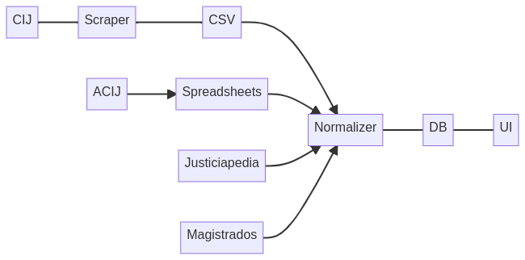

# Scraper de CIJ

EL scraper del Observatorio de Corrupción del [CIJ](https://www.cij.gob.ar/causas-de-corrupcion.html) se compone de tres procesos:

- **Scrapeado**: Baja todos los datos a multiples archivos csv
- **Normalizado**: En esta etapa se unifica los datos scrapeados y se agregagan datos de otras fuentes.
  - Unificamos los nombres de organismos públicos, involucrados, delitos, etc mediantes múltiples spreadsheets.
  - Unimos con datos externos como las biografías obtenidas de [Justiciapedia](https://chequeado.com/justiciapedia/).
  - Bajamos los PDF de resoluciones de cada causa y nos quedamos con el texto de resolución.
  - Notificamos por email en caso de algún problema.
- **Actualizado de la base de datos**: Actualizamos los datos en ArangoDB que después utiliza el Observatorio



## Setup local

```bash
cp .env.sample .env
# Configuramos las vars en .env
docker-compose build

# La proxima vez solo
./run.sh
```

## Diccionario de Datos

- En todos los CSV, la columna `expediente` es la que nos permite unir loc CSV
- Algunas columnas, como `delito` estan duplicadas con un guion bajo. Esta (`_delito`) es el dato tal cual lo obtuvimos del CIJ mientras que la otra columna es la normalizada

### cij/causas.csv

| Nombre columna | tipo | descripción | ejemplo |
|---|---|---|---|
| expediente | string | código interno del CIJ. Esta columna es la que permine unir todos los csv | CFP 1614/2016 |
| estado | string | Estado actual de la causa | AUTO DE PROCESAMIENTO SIN PRISION PREVENTIVA |
| ultima_actualizacion | date | fecha de la última actuliazación en el CIJ | 20/09/2021 |
| caratula | string | título de la carátula del expediente | |
| terminado | boolean | | |

### cij/delitos.csv

| Nombre columna | tipo | descripción | ejemplo |
|---|---|---|---|
| expediente | string | código interno del CIJ. Esta columna es la que permine unir todos los csv | CFP 1614/2016 |
| delito | string | Nombre normalizado del delito | ABUSO DE AUTORIDAD Y VIOLACIÓN A LOS DEBERES DE FUNCIONARIOS PÚBLICOS |
| _delito | string | Delito original en el CIJ | ABUSO DE AUTORIDAD Y VIOL. DEB.FUNC.PUBL.(ART.248) |

### cij/implicados.csv

| Nombre columna | tipo | descripción | ejemplo |
|---|---|---|---|
| expediente | string | código interno del CIJ. Esta columna es la que permine unir todos los csv | CFP 1614/2016 |
| relacion | string | Relación del implicado con la causa | DENUNCIADO, IMPUTADO, QUERELLANTE, DENUNCIANTE |
| implicado | string | |
| _implicado | string | |
| letrado | string | |
| _letrado | string | |

### cij/resoluciones.csv

| Nombre columna | tipo | descripción | ejemplo |
|---|---|---|---|
| expediente | string | código interno del CIJ. Esta columna es la que permine unir todos los csv | CFP 1614/2016 |
| fecha | date | Fecha de la publicación de la resolución | 23/06/2020 |
| camara | string | Nombre de la cámara que publico la resolución | TRIBUNAL ORAL EN LO CRIMINAL FEDERAL 1 |
| sala | string | Si corresponde, número de la sala | |
| pdf_nombre | string | Nombre del CIJ del pdf | 8227126.pdf |
| pdf_url | string | URL del CIJ del PDF | https://www.cij.gob.ar/scp/include/showFile.php?acc=showFAR&id=8227126&tipo=corrupcion-administrativa |
| pdf_hash | string | MD5 del PDF | |
| resuelve_texto | string | Procesamos los PDF y nos quedamos con lo que resuelve. | |

### cij/resoluciones_firma.csv

| Nombre columna | tipo | descripción | ejemplo |
|---|---|---|---|
| pdf_nombre | string | Nombre del CIJ del pdf | 8227126.pdf |
| firma | string | Nombre de la persona que firmo | RODRIGO GIMENEZ URIBURU |
| cargo | string | Cargo de la persona que firmo | JUEZ DE CÁMARA |
